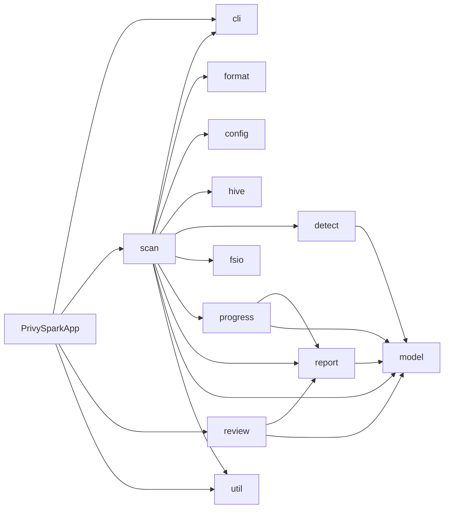
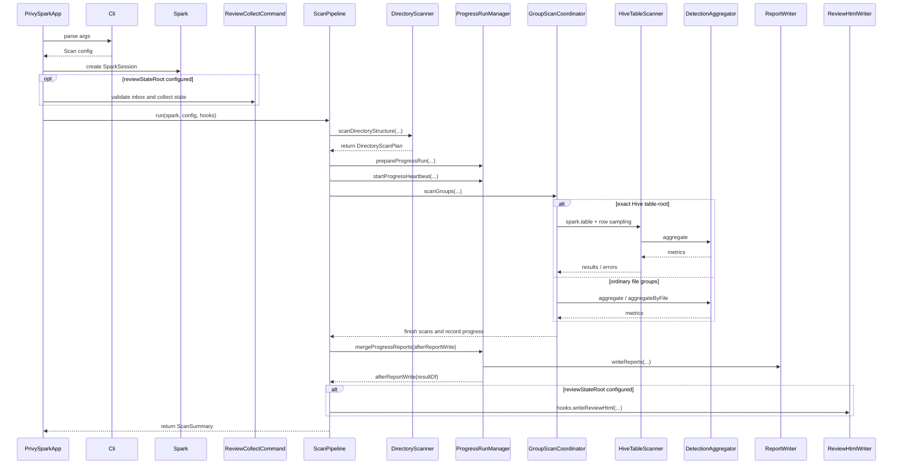

# Architecture Overview

## Goals

- Scan large datasets reliably with Spark-based batch processing.
- Improve efficiency through input expansion and grouping without losing identifier semantics.
- Continue processing as much as possible even when some files or groups fail.

## Components

- `cli/Cli.scala`: CLI arguments and default execution options
- `format/FormatDetector.scala`: first-stage format detection by extension
- `format/CompressionStreams.scala`: codec wrapping for direct compressed text-style files and compressed tar streams
- `config/RulesetLoader.scala`: built-in/external ruleset loading, suppression loading, and regex validation
- `util/DriverLogger.scala`: driver log level parsing and structured log format
- `detect/DetectionAggregator.scala`: metric aggregation and fallback strategies
- `hive/HiveTableLookup.scala`: Hive Metastore JDBC enumeration, table `LOCATION` normalization, longest-prefix lookup indexing, and broadcast creation
- `scan/ScanPipeline.scala`: scan orchestration, caches, progress lifecycle, report merge, and review HTML hook
- `scan/DirectoryScanner.scala`, `scan/GroupScanCoordinator.scala`: input expansion, grouping, and scan execution
- `report/ReportWriter.scala`: final report writing and format-specific outputs
- `PrivySparkApp.scala`: CLI dispatch, SparkSession lifecycle, and scan pipeline/review hooks
- `model/Models.scala`: result, error, and PII-rule models; `model/ScanPlanModels.scala`: input/group/scan-plan ADTs
- `review/ReviewCollectCommand.scala`, `review/collect/`: response validation, collection lock, cumulative state, and file replacement
- `review/ReviewHtmlWriter.scala`, `review/ReviewHtmlRenderer.scala`: findings, HTML splitting, template/script rendering
- `src/main/resources/review/review.js`: browser form state, sorting, validation, CSV/TSV editing, and JSON download

## Development and Verification Tools

- `src/test/scala/io/github/jonggeun2001/privyspark/SampleDatasetGenerator.scala`: sample dataset generator for reproducing input-handling branches
- `generateSampleDatasets` and `packageSampleDatasets` in `build.gradle.kts`: regeneration and release packaging tasks for sample datasets

## Processing Flow

1. Validate CLI and input/output/review paths, then create SparkSession.
2. If `--review-state-root` is set, collect the inbox first; response/lock failures stop the command before scanning.
3. Prepare parallelism/Excel settings, CSV/schema/parse caches, ignore patterns, and explicit/state allowlists.
4. Load rulesets, pre-validate regexes, and merge ruleset/CLI suppressions.
5. When all Hive JDBC options are present, query `DBS`/`TBLS`/`SDS` once on the driver and broadcast the table `LOCATION` index.
6. Discover physical files and apply ignore filtering. An exact Hive table-root match without ignored paths creates a table plan and skips file expansion/schema splitting.
7. For ordinary files, expand archive entries/workbook sheets, pass through direct compressed text-style inputs, probe magic bytes, normalize CSV dialect/text fallback, and filter ignored archive entries.
8. Normalize layout directories, group by `(directory, format)`, sample representative schemas, split groups, and assess directory-identifier promotion.
9. Acquire `<output>/_progress-preparing.json`, prepare `<output>/_progress/<run_id>`, clean stale progress, start heartbeat, and write plan errors.
10. Scan exact Hive table groups through `spark.table` and row sampling.
11. Revalidate ordinary sampled CSV/JSON groups through coordinator exact split before scanning the resulting groups.
12. Run bounded schema validation where needed before batch scans; file-scan `xlsx` and other non-batch groups. Physical file paths may use file sampling; otherwise deterministic row sampling applies.
13. Fall back to file scans on normal batch failures; sampled schema drift/failures can trigger policy-based exact resplitting.
14. Apply recurring allowlists and record group/file completion JSONL. Group/allowlist markers observe active work; file markers are opt-in.
15. Merge progress, aggregate final Hive table results, and write selected `scan_results`/`scan_errors` formats.
16. If `--review-state-root` is set, generate HTML from final results. On success, clean run progress/staging and close SparkSession.

## Operational Invariants

- `scan_results` stores two interpretation aids: `sample_matched_fragment` keeps the detected fragment itself, and `sample_raw_value` keeps only up to 50 characters of surrounding context on each side.
- Final `scan_results` groups Hive-mapped rows by `hive_table_fqn`, column, and PII type, sums `non_empty_value_count`, and recalculates ratios and confidence. `_progress` JSONL shards are raw in-progress records before this final aggregation.
- `--pre-scan-parallelism` applies to directory discovery, input expansion, format probing, and schema split.
- `--ignore` and `--ignore-file` apply immediately after physical file discovery and again during archive entry expansion.
- Suppression is applied during `DetectionMetrics.buildMetrics`, before metric planning, so excluded `(column, pii_type)` pairs never materialize result rows.
- Directory discovery uses breadth-first traversal and parallelizes `listStatus` per BFS level, capped by the safety ceiling `64`.
- After file discovery, effective pre-scan parallelism is bounded by the discovered file count and the safety ceiling `64`.
- Hive lookup index creation uses the configured JDBC driver class rather than Spark Catalog/`enableHiveSupport()` and enumerates only table-level `LOCATION` values. CLI `--hive-metastore-jdbc-driver-class` takes precedence over Spark conf `spark.privyspark.hiveMetastore.jdbcDriverClass`; when both are omitted, the default driver class is `org.mariadb.jdbc.Driver`. If options are omitted or lookup fails, it falls back to an empty mapping. However, a scan group whose input path exactly matches a table-level `LOCATION` and has no ignore matches is read through Spark Catalog with `spark.table(db.table)`. `hive_table_fqn` is intentionally excluded from review snapshot comparison payloads.
- `xlsx` pre-scan lightly parses workbook metadata and header row XML on the driver to plan visible sheets and schema signatures. Sheet body row/cell reads are deferred to the executor-side StAX scan path.
- `xlsx` file-level scans also flow through `scanGroupByFile`, so they consume CLI `--file-parallelism` or `spark.privyspark.fileParallelism`.
- `--file-sample-ratio` applies to physical file batch scans and file-fallback scans, but only when a group has more files than `--file-sample-min-files`; when it does apply, PrivySpark selects a stable hash-ranked file subset of size `ceil(fileCount * ratio)` with at least one file.
- Exact Hive table-root scans apply deterministic row sampling to `spark.table`; file sampling options do not apply.
- When file sampling actually applies, `--sample-ratio < 1.0` is ignored for that group and a warning is logged.
- File-sampled group review rows record `review_scope_file_identifiers` and `review_scope_file_fingerprints` only for the selected files, not for the entire group directory.
- Sampled `text` groups skip pre-batch exact schema validation, while sampled Parquet/ORC/Avro groups keep bounded schema validation before the batch path. Both keep file-level identifiers on the batch path.
- Sampled groups are never promoted to directory-level identifiers before exact-split validation.
- Archive and Excel logical inputs keep their own identifiers.
- Without `--output-format`, the public output contract is `parquet/scan_results` and `parquet/scan_errors`. Explicit formats select only the requested `parquet/...`, `csv/...`, and/or `excel/*.xlsx` outputs.
- Clean completions also emit `meta/completions` markers. File fallback scans buffer file progress in memory by default and flush once when the group finishes.
- File in-flight markers are off by default; enable them with `spark.privyspark.progress.fileMarker.enabled=true`.
- In-flight markers under `_progress/<run_id>/in-flight` are best-effort diagnostics for currently active work. Completed work and recoverable failures delete markers; unrecovered group/file failures that make the application `FAILED` preserve them.
- In-flight marker filenames preserve filesystem-safe UTF-8 letters/digits plus `.`, `_`, and `-`; path separators and other characters are replaced with `_`.
- `_progress` is cleaned based on staleness when the next run starts. There is no shutdown hook cleanup or checkpoint resume that skips previously completed groups.

## Why It Works This Way

- Keeping `_progress` separate from final outputs preserves both observability and final report integrity.
- File fallback progress flushes at group granularity to reduce the HDFS hot path created by per-file results/errors/completions shards and heartbeat updates during small-file scans.
- In-flight markers expose current bottleneck work and the last active group/file work at application failure while preserving the completed-progress JSONL contract.
- Cleanup happens on the next run instead of a shutdown hook because forced YARN termination and `kill -9` make shutdown hooks unreliable.
- `_progress-preparing.json` exists so concurrent startup cannot delete another run's freshly created progress root before the active marker is ready.
- The owner run can self-heal an unreadable `active-run.json` from `meta/run.json` so a damaged marker does not unnecessarily kill a live run.

## Component Dependencies

