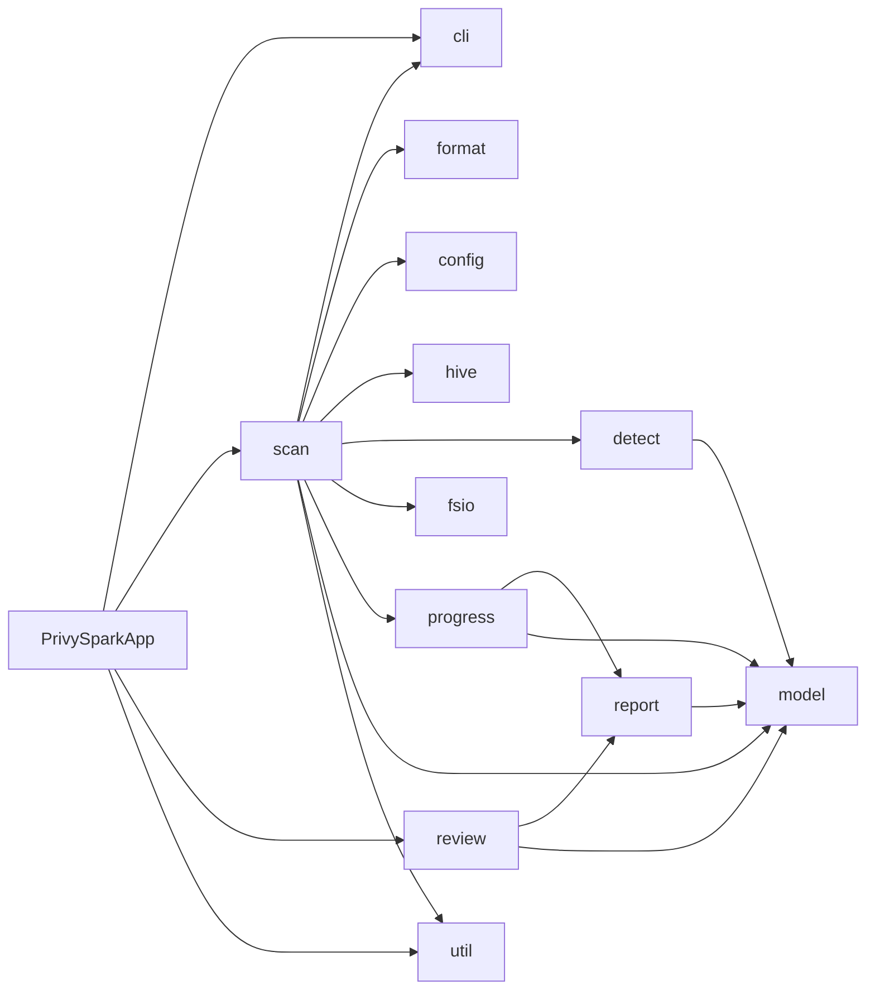
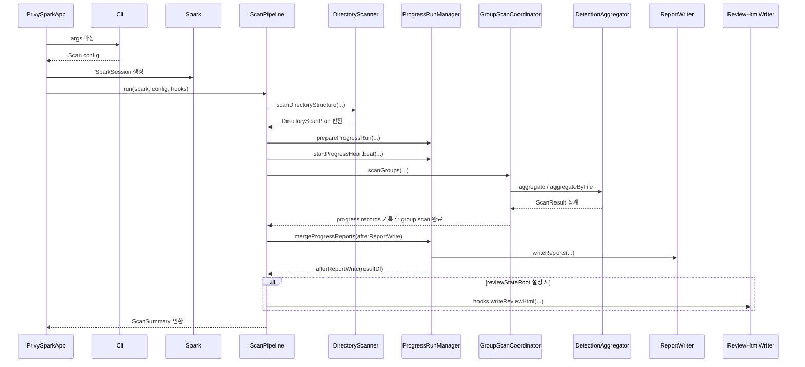

# 아키텍처 개요

## 목표
- Spark 기반 배치 처리로 대용량 데이터셋을 안정적으로 스캔합니다.
- 입력 확장과 그룹화로 처리 효율을 확보하되 결과 식별자 의미를 유지합니다.
- 일부 파일 또는 그룹 실패가 있어도 가능한 범위를 계속 처리합니다.

## 구현 컴포넌트
- `cli/Cli.scala`: 실행 인자와 기본 실행 옵션
- `format/FormatDetector.scala`: 확장자 기반 1차 포맷 식별
- `format/CompressionStreams.scala`: direct compressed text-style file과 compressed tar stream의 codec wrapping
- `RulesetLoader.scala`: 기본/외부 ruleset과 suppression 로딩, regex 검증
- `util/DriverLogger.scala`: driver 로그 레벨 해석과 공통 로그 포맷
- `detect/DetectionAggregator.scala`: 규칙별 집계와 fallback 전략
- `hive/HiveTableLookup.scala`: Hive Metastore JDBC 조회, table `LOCATION` 정규화, longest-prefix lookup 인덱스, broadcast 생성
- `scan/ScanPipeline.scala`: scan command orchestration, progress run, 최종 report merge, review HTML hook 연결
- `scan/DirectoryScanner.scala`, `scan/GroupScanCoordinator.scala`: 입력 확장, 그룹화, 스캔 실행
- `report/ReportWriter.scala`: 최종 리포트 저장과 포맷별 산출물 생성
- `PrivySparkApp.scala`: CLI dispatch, SparkSession 생명주기, scan pipeline hook 주입
- `Models.scala`: 결과/오류/규칙 모델

## 개발·검증 도구
- `src/test/scala/io/github/jonggeun2001/privyspark/SampleDatasetGenerator.scala`: 입력 처리 케이스를 재현하는 샘플 데이터셋 생성기
- `build.gradle.kts`의 `generateSampleDatasets`, `packageSampleDatasets`: 샘플 데이터셋 재생성과 릴리즈용 패키징 태스크

## 처리 플로우
1. 입력 경로 검증
2. ruleset 로드, regex 사전 검증, ruleset/CLI suppression 병합
3. Hive JDBC lookup 옵션이 모두 지정되면 driver에서 설정된 JDBC driver class로 Hive Metastore `DBS`/`TBLS`/`SDS`를 1회 조회해 table `LOCATION` broadcast 인덱스 생성
4. 물리 파일 수집과 ignore 패턴 필터
5. archive 엔트리 확장, workbook metadata 기반 시트 목록 확장, direct compressed text-style input passthrough, 무확장자/미지원 확장자 magic-byte 판별, CSV dialect 감지 및 text fallback 정규화, archive entry ignore 필터
6. `(directory, format)` 기준 1차 그룹화
7. 대표 파일 기준 스키마 샘플링
8. schema-aware split 및 디렉토리 식별자 승격 가능성 판정
9. sampled CSV/JSON group이면 exact split 재검증 후 재분류된 그룹 스캔
10. `<output>/_progress-preparing.json` lock 획득 후 `<output>/_progress/<run_id>` 준비 및 stale progress 정리
11. sampled non-CSV/non-JSON group을 포함한 batch-capable group이면 필요 시 file sampling 후 그룹 batch scan
12. `xlsx` 등 batch scan 미지원 group은 direct file scan
13. 일반 group batch 실패 시 파일 단위 fallback
14. group/file/allowlist 작업 실행 중 in-flight marker를 만들고, group/file 완료 시 progress JSONL 기록
15. progress JSONL을 Hive 테이블 단위 최종 결과 집계가 반영된 `scan_results`/`scan_errors`로 merge 후 `_progress/<run_id>` 삭제

## 운영 불변 조건
- `scan_results`에는 해석용 샘플 값 두 개를 저장합니다. `sample_matched_fragment`는 검출된 조각 그대로이고, `sample_raw_value`는 앞뒤 최대 50자 문맥만 저장합니다.
- 최종 `scan_results`는 Hive 매핑이 있는 결과를 `hive_table_fqn`, 컬럼, 개인정보 유형 단위로 묶고 `non_empty_value_count`를 합산해 비율과 confidence를 재계산합니다. `_progress` JSONL shard는 최종 집계 전 원시 진행 기록입니다.
- `--pre-scan-parallelism`은 디렉터리 discovery, 파일 단위 입력 확장, 포맷 판별, 그룹별 schema split 경로에 적용합니다.
- `--ignore`, `--ignore-file`은 물리 파일 수집 직후와 archive entry 확장 단계에서 적용합니다.
- suppression은 `DetectionAggregator.buildMetrics`에서 metric plan 생성 전에 적용해 제외된 `(column, pii_type)` 조합이 결과 row 자체를 만들지 않게 합니다.
- 디렉터리 discovery는 BFS 순회로 진행하고, 각 레벨의 `listStatus`는 safety ceiling `64` 안에서 병렬 실행합니다.
- discovery 이후 pre-scan 병렬도 최종 적용값은 발견된 파일 수와 safety ceiling `64` 기준으로 축소합니다.
- Hive lookup 인덱스 생성은 Spark Catalog/`enableHiveSupport()`를 사용하지 않고 설정된 JDBC driver class로 table-level `LOCATION`만 열거합니다. CLI `--hive-metastore-jdbc-driver-class`가 Spark conf `spark.privyspark.hiveMetastore.jdbcDriverClass`보다 우선하고, 둘 다 없으면 기본 driver class `org.mariadb.jdbc.Driver`를 사용합니다. 옵션 미지정 또는 조회 실패 시 빈 매핑으로 진행합니다. 단, 입력 path가 table-level `LOCATION`과 정확히 일치하는 scan group은 Spark Catalog의 `spark.table(db.table)`로 읽습니다. 결과 비교용 review snapshot payload에는 `hive_table_fqn`을 포함하지 않습니다.
- `xlsx` pre-scan은 드라이버에서 workbook metadata와 header row XML만 경량 파싱해 visible sheet 목록과 schema signature를 계획합니다. sheet body row/cell 읽기는 executor-side StAX scan 단계로 넘깁니다.
- batch scan을 지원하지 않는 `xlsx` file-level scan 경로도 `scanGroupByFile`을 통해 CLI `--file-parallelism` 또는 `spark.privyspark.fileParallelism` 설정을 사용합니다.
- `--file-sample-ratio`는 batch scan과 file fallback scan에서 적용하고, 그룹 파일 수가 `--file-sample-min-files`보다 클 때만 `ceil(fileCount * ratio)` 수만큼 최소 1개 파일을 안정적인 해시 순위로 선택합니다.
- 실제 file sampling이 적용된 그룹에서는 `--sample-ratio < 1.0`을 무시하고 warning 로그를 남깁니다.
- file sampling이 적용된 group review row의 `review_scope_file_identifiers`, `review_scope_file_fingerprints`는 전체 디렉토리가 아니라 실제 선택된 파일 subset만 기준으로 기록됩니다.
- sampled `text` group은 batch 전 exact schema validation을 건너뛰고, sampled Parquet/ORC/Avro group은 batch 전 bounded schema validation을 유지합니다. 두 경로 모두 batch 경로에서 파일 식별자를 유지합니다.
- sampled group은 exact split 검증 전까지 디렉토리 식별자로 승격하지 않습니다.
- archive와 Excel 논리 입력은 자체 식별자를 유지합니다.
- 최종 출력 계약은 기본 `parquet/scan_results`, `parquet/scan_errors`이고, CLI `--output-format`에 따라 `csv/...`, `excel/*.xlsx`가 추가됩니다.
- clean completion도 `meta/completions` marker를 남깁니다. file fallback scan은 기본적으로 file별 progress를 메모리에 모아 group 종료 시 한 번 flush합니다.
- `_progress/<run_id>/in-flight` 아래 in-flight marker는 현재 실행 중인 작업을 보여주는 best-effort 진단 정보입니다. 완료된 작업과 처리 가능한 실패는 삭제되고, application `FAILED`로 이어지는 미복구 group/file 실패는 보존됩니다.
- in-flight marker 파일명은 파일명에 안전한 UTF-8 문자/숫자와 `.`, `_`, `-`를 보존하고, 경로 구분자와 그 외 문자는 `_`로 치환합니다.
- `_progress`는 다음 실행 시작 시 stale 여부를 판정해 정리합니다. shutdown hook은 사용하지 않습니다.

## 왜 이렇게 설계했는가
- progress 경로를 최종 출력과 분리한 이유는 부분 결과 관측성과 최종 리포트 일관성을 동시에 확보하기 위해서입니다.
- file fallback progress를 group 단위로 flush하는 이유는 small-file scan에서 파일마다 results/errors/completions shard와 heartbeat update를 만드는 HDFS hot path를 줄이기 위해서입니다.
- in-flight marker는 완료 progress JSONL 계약은 유지하면서 현재 병목 작업과 실패 당시 마지막 group/file 작업을 외부에서 관찰할 수 있게 합니다.
- 종료 훅 대신 다음 실행 cleanup을 택한 이유는 YARN 강제 종료나 `kill -9` 상황에서 훅 신뢰도가 낮기 때문입니다.
- `_progress-preparing.json`을 active marker보다 먼저 두는 이유는 startup race에서 서로의 fresh root를 지우지 않게 하기 위해서입니다.
- unreadable `active-run.json`을 owner run이 `meta/run.json`으로 self-heal하는 이유는 marker 손상이 live run을 불필요하게 실패시키지 않게 하기 위해서입니다.

## 컴포넌트 의존성

